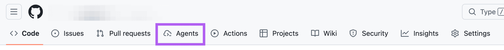
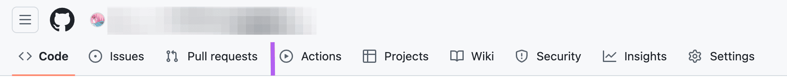

# GitHub Agents Tab Hider

A lightweight Chrome extension that removes the "Agents" navigation tab from GitHub's interface, providing a cleaner workspace for developers who don't use this feature.

## Features

- Automatically hides the "Agents" tab across all GitHub pages
- No data collection or tracking

### Before



### After



## Installation

1. Clone or download this repository
   ```bash
   git clone https://github.com/fjt-dev/github-agents-tab-hider
   ```
2. Open Chrome and navigate to `chrome://extensions/`
3. Enable **Developer mode** (toggle in the top-right corner)
4. Click **Load unpacked** and select the project folder
5. The extension is now active on github.com

## Support

Open an issue on GitHub for bugs or suggestions.

---

**Note**: This extension is not affiliated with or endorsed by GitHub, Inc.
